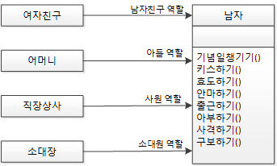
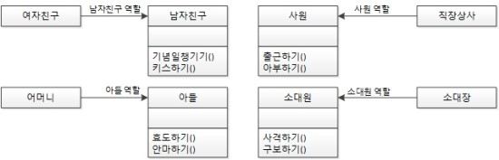
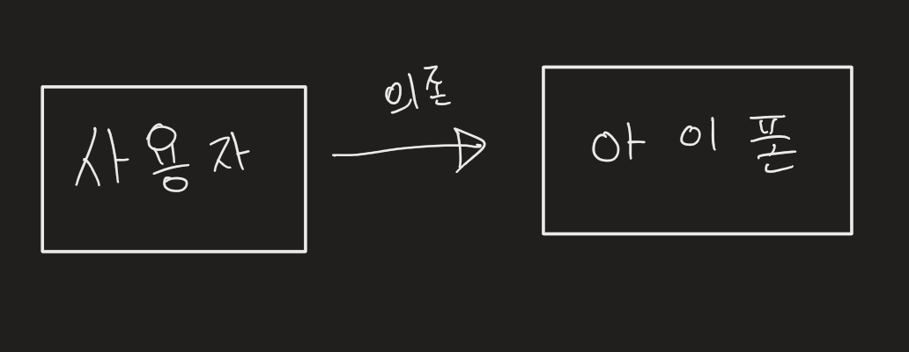
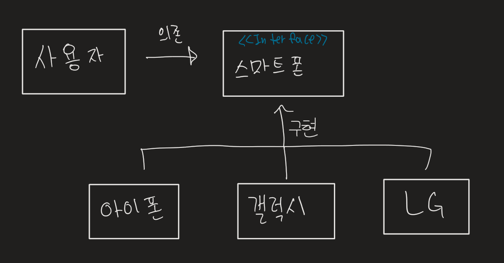

# 객체지향 프로그래밍(OOP)

> 많은 객체(Object)들이 모여 상호 협력, 메시지를 주고 받으며 데이터를 처리하는 현실세계의  
> 방식을 따온 프로그래밍 패러다임. 특징으로 캡슐화, 상속, 추상화, 다형성을 가지며, SOLID 원칙을 따른다.
###  장점
+ 코드의 재사용성 증대
+ 유지보수 용이
+ 코드의 간결화
###  단점
+ 처리 시간이 비교적 오래걸림
+ 프로그램 설계시 많은 상황에 따른 고려가 필요, 시간의 증대. 

특징
===
### 1. 캡슐화 (Encapsulation)
> 하나의 객체에 대해 그 객체가 특정한 목적을 위한 필요한 변수나 메소드를 하나로 묶는 것

객체 안의 모듈 간의 요소가 밀접한 관련이 있는 것으로 구성하여 응집도를 높이고 결합도를 줄여야  
향후 요구사항 변경에 대처하는 좋은 설계 방법이 된다.  
그 과정에서 결합도를 낮추는 방법으로 접근제한자를 이용하는 정보 은닉을 활용한다.  
```
캡슐화와 정보은닉은 동일개념이 아니다!
캡슐화를 하면 불필요한 정보를 감출 수 있기 때문에, 정보은닉을 할 수 있다는 특징이 있다는 것
즉, 리모컨을 사용하는 user입장에서 리모컨의 조작기능만 알면 되는 것을 내부 회로도까지 알필요가 없다.
```  

| 접근 제한자(JAVA 기준) | 적용 대상 | 타 패키지 | 타 패키지의 자식 클래스 | 동일 패키지 | 동일 클래스 |  
|:---:|:---:|:---:|:---:|:---:|:---:|  
| `Public` | Class, Field, Ctor, Method | :heavy_check_mark: | :heavy_check_mark: | :heavy_check_mark: | :heavy_check_mark: |  
| `Protected` | Field, Ctor, Method |  | :heavy_check_mark: | :heavy_check_mark: | :heavy_check_mark: |   
| `Default` | Class, Field, Ctor, Method |  |  | :heavy_check_mark: | :heavy_check_mark: |  
| `Private` | Field, Ctor, Method |  |  |  | :heavy_check_mark: |  

### 2. 상속
> 기존 클래스의 기능을 가져와 재사용함과 동시에 새로운 기능을 추가하여 사용이 가능한 것

Q. 왜 상속이 필요한가?  
A. 코드의 중복성을 없애기 위함.  
큰 공통점의 속성을 상위 부모 클래스로 선언후, 부모 클래스에서 상속받고, 개별의 속성을 선언하면 코드의 중복성을 줄일 수 있다.

### 3. 추상화
> 목적과 관련이 없는 부분을 제거하여 필요한 부분만을 표현하기 위한 개념

은행 관련 애플리케이션을 만든다고 가정해 볼때, 은행을 이용하는 고객의 정보가 필요할텐데,  
고객의 정보라고 하면 이름, 주소, 휴대폰 번호, 주소 등이 존재한다.  
그런데, 사실 정보라는 범위가 모호하므로 위의 정보 외에도 좋아하는 음식, 취미, 특기 등까지도 포함할 수 있습니다.  
다만, 은행 애플리케이션에서의 고객 정보로 좋아하는 음식, 취미, 특기는 필요하지 않습니다.  
그래서 이러한 불필요한 정보를 제거함으로써 중요한 정보만 남기는 것또한 추상화라 말할수 있음.

### 4. 다형성
> 형태가 같으나 상황에 따라 다른 기능을 하는 것

같은 포유류 클래스로부터 상속받은, 고양이와 말의 클래스가 있다고 가정한다면,  
같은 `울음` 이란 속성값을 상속 받아 가지고 있다. 하지만 고양이와 말의 울음 소리가 다르다.  
이런 것을 다형성이라 칭한다.

`overloading & overriding`
+ Overloading - 같은 이름의 메서드를 사용하나, 메서드마다 다른 용도로 사용되며 그 결과물도 다르게 구현할 수 있게 만드는 것.
    + 메서드의 이름은 같으나 파라미터가 다른경우 오버로딩에 속함
+ Overriding - 부모 클래스에서 상속받은 자식 클래스에서 부모 클래스에서 만들어진 메서드를 입맛에 맞춰 재정의하여 사용하는 것.

5원칙 (SOLID)
===
### 1. S (SRP : Single Responsibility Principle, 단일 책임 원칙)
> 한 클래스는 하나의 책임만 가져야 한다.

+ 장점
    + 테스팅 - 하나의 책임만 갖는 클래스는 테스트 케이스가 훨씬 적습니다.
    + 낮은 결합(coupling) - 단일 클래스의 기능이 적을수록 종속성이 줄어듭니다.
    + 조직, 구성(Organization) - 소규모의 잘 구성된 클래스는 모놀리식(monolithic) 클래스보다 보기 쉽습니다.  



### 2. O (OCP : Open/Closed Principle, 개방 폐쇄 원칙)
> 확장에는 열려있으나, 변경에는 닫혀있어야 함.  
> 기존 구성요소는 수정이 일어나지 말아야하며 쉽게 확장이 가능하여 재사용할 수 있어야 한다

상속과 다형성과 연관된 케이스로, animal이라는 클래스에서 고양이, 강아지의 울음소리를 switch case문으로 작성시, 다른 객체의 추가시 효율이 좋지 못하다.  
animal이란 클래스에서 강아지, 고양이라는 새로운 자식클래스를 생성하고 울음소리만을  
오버라이딩하여 사용할시 코드의 재사용성이 증가하는 효과를 가져올 수 있다.

### 3. L (LSP : Liskov’s Substitution Principle)
> 프로그램의 객체는 프로그램의 정확성을 깨뜨리지 않으면서 하위 타입의 인스턴스로 변경 가능하여야 한다.

하위 클래스의 인스턴스는 상위형 객체 참조 변수에 대입해 상위 클래스의 인스턴스 역할을 하는데 문제가 없어야 한다.

### 4. I (ISP : Interface Segregation Principle)
> 특정 클라이언트를 위한 인터페이스 여러 개가 범용 인터페이스 하나보다 낫다.

자동차라는 인터페이스의 속성에 바퀴, 엔진, 의자, 문 등등이 있을것이다.
하지만 각각 자동차에서 어느 하나가 빠진 설계가 있다고한다면 자동차의 인터페이스를 상속받지 못한다.  
이런 상황을 대비하여 자동차 인터페이스를 자잘하게 쪼개 바퀴, 엔진, 의자, 문 등의 클래스로 나눠 설계하라.   


### 5. D (DIP : Dependency Inversion Principle)
> 추상화에 의존한다. 구체화에 의존하면 안된다.  
> interface를 적극적으로 활용하라


