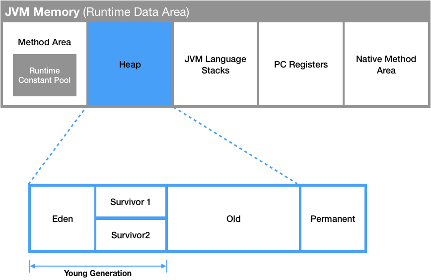
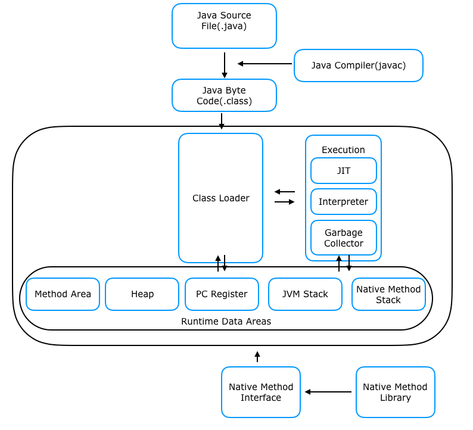

JVM
===
> OS에 종속받지 않고 JAVA 애플리케이션을 실행하기 위하여 만들어진 스택기반의 VM, 주로 JAVA Application을 클래스로더를 통해 읽어 JAVA API와 함께 실행하며, 프로그램의 메모리 GC를 통해 관리, 최적하는 역할도 수행한다.  
> (개발자) 어떤 기기상에서 실행되고 있는 프로세스, 특히 자바 앱에 대한 리소스를 대표하고 통제하는 서버

#### 클래스 로더(Class Loader)
런타임시 JVM 내로 클래스파일을 동적으로 로드하고, 링크를 통하여 배치 작업을 수행하는 모듈  
 
#### 실행 엔진
바이트 코드를 실행시키는 역할. 두가지 방식으로 기계어로 변환 시킴
+ 인터프리터 - 바이트 코드를 한줄씩 실행, 한줄씩 실행시키기에 느리다는 단점이 존재.
+ JIT(Just In Time) - 인터프리터가 일정수 이상 반복되는 코드 발견시 JIT complier가 반복되는 코드를 Native Code로 변환 그 후, 인터프리터 코드는 실행되지 않고 native code로만 실행하는데, native code는 실행후 캐시에 보관되기때문에 한번 실행 할 경우 빠르지만, 처음 실행할 경우 인터프리터보다 느린 특징을 가진다.

#### 런타임 데이터 영역(Runtime Data Area)
+ PC Register - Thread가 어떤 명령어로 실행되어야 하는지 기억하는 장소(JVM 명령의 주소), 각 Thread마다 한 개씩 존재한다. 
+ Stack Area - 지역변수, 매개변수, 메서드 정보, 임시 데이터들을 저장, 메서드 수행이 끝날시 `프레임`별로 삭제. 실제 객체는 힙에 할당되며, 해당 래퍼런스만 스택에 저장.
+ Heap Area - 런타임에 동적으로 할당되는 데이터(`new`명령어로 선언된 인스턴스, Object와 배열등)가 저장되는 영역으로, GC의 대상영역임과 동시에 모든 Thread가 공유하는 자원.
  
    + New/Young Generation 
      + Eden - 객체들이 최초로 저장되는 공간, 생성된지 얼마안된 객체는 이곳에 저장된다.
      + Survivor 0/1 - Eden에서 참조되는 객체들이 저장되는 공간
    + Old - Survivor 영역에서 오래 살아있는 객체들을 저장하는 장소, 특정회수 이상이 참조되어 기준 Age를 초과한 객체
      + Major GC - Old Generation의 메모리도 충분하지 않으면, 해당 영역에도 GC가 발생하게 되는데, 이때 발생하는 GC
    + Permanent Generation - JVM 클래스와 메서드 객체를 저장하는 공간. JDK 8버젼 이후로 metaspace영역으로 대체되었다.
    + Metaspace - Permanent Generation을 대체하는 영역으로, OS가 자동으로 크기를 조절하는 특성을 지님.  
    
+ Method Area - 모든 Thread가 자원을 공유하며, 처음 메모리 공간에 할당시, 초기화되는 대상을 저장하기 위한 메모리 공간. 주로 클래스 멤버 변수, 메소드 정보, Type 정보, Constant Pool, static, final 변수등 생성. 상수풀(Constant Pool)은 모든 Symbolic Reference를 포함하고 있다. 
+ Native Method Stack - 실제 실행 할 수 있는 기계어로 작성된 프로그램을 실행시키는 영역. 이부분을 통해 C code를 실행시켜 Kernal에 접근가능하다.
#### 장점
+ 개발자는 OS상관없이 JAVA Application을 개발 가능.
+ Write Once, Run Anywhere
#### 단점
+ JVM이 설치되어 있지 않은 곳일시 Write Once, Run Anywhere가 적용되지 않음.

FLOW
---
1. 프로그램이 실행되면, JVM은 OS로부터 이 프로그램이 필요로하는 메모리를 할당받음. JVM은 이 메모리를 용도에 따라 여러 영역으로 나누어 관리함
2. 자바 컴파일러(JAVAC)가 자바 소스코드를 읽고, 자바 바이트코드(.class)로 변환시킴
3. 변경된 class 파일들을 클래스 로더를 통해 JVM 메모리 영역으로 로딩함
4. 로딩된 class 파일들은 Execution engine을 통해 해석됨
5. 해석된 바이트 코드는 메모리 영역에 배치되어 실질적인 수행이 이루어짐. 이러한 실행 과정 속 JVM은 필요에 따라 스레드 동기화나 가비지 컬렉션 같은 메모리 관리 작업을 수행함

